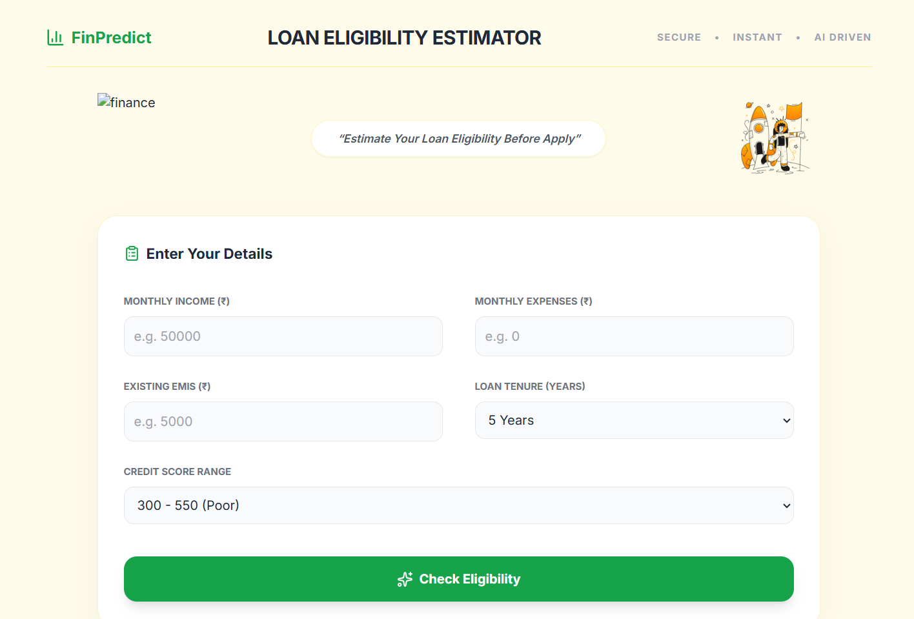

# AI Loan Eligibility Advisor

An intelligent web application that estimates **loan eligibility, EMI capacity, and financial risk** using real-world banking logic such as FOIR, debt-to-income ratio, and credit score evaluation.

This project simulates how financial institutions assess a loan applicant's repayment capacity.

---

---

## AI Loan Estimator Preview

<p align="center">
  
</p>

---

# Project Overview

Before applying for a loan, it is important to understand whether the application is financially feasible.

This tool helps users:

• Estimate the maximum loan amount they can afford  
• Calculate a safe EMI range  
• Evaluate financial risk  
• Receive AI-style financial advice  

The system uses commonly used banking metrics to generate realistic estimations.

---

# Key Features

### Loan Eligibility Estimation
Calculates the maximum loan amount a user can safely borrow.

### EMI Capacity Analysis
Determines the monthly EMI a borrower can afford.

### Credit Score Based Interest
Interest rates dynamically adjust based on credit score category.

### Risk Level Detection
Classifies applicants into:

- Low Risk
- Medium Risk
- High Risk

### AI Loan Advisor
Provides personalized suggestions to improve loan approval chances.

---

# Financial Logic Used

The estimator uses several real-world banking principles.

### FOIR (Fixed Obligation to Income Ratio)

Banks typically allow **50% of income** to go toward debt obligations.

### Debt-to-Income Ratio (DTI)

Measures total financial obligation relative to income.

### EMI Safety Cap

A single new loan EMI should not exceed **40% of income**.

### Interest Rate Based on Credit Score

| Credit Score | Category | Interest Rate |
|--------------|----------|--------------|
| 300–550 | Poor | 15% |
| 550–650 | Fair | 13% |
| 650–750 | Good | 11% |
| 750+ | Excellent | 9.5% |

---

# Loan Calculation Model

Loan eligibility is calculated using the **annuity formula** used by banks.

Loan Amount Formula:

```
P = EMI × (1 − (1+r)^−n) / r
```

Where

- P = Loan Amount
- r = Monthly Interest Rate
- n = Number of Months

---

# Tech Stack

Frontend  
• HTML5  
• Tailwind CSS  

Icons  
• Lucide Icons  

Fonts  
• Google Fonts (Inter)

Logic  
• Vanilla JavaScript

---

# Dashboard Preview

Add your screenshot here.

```
images/dashboard.png
```

Example:

```html
<p align="center">
  
</p>
```

---

# How It Works

1. User enters financial details
2. System calculates disposable income
3. Determines safe EMI limit
4. Applies credit score interest rate
5. Estimates loan principal
6. Evaluates risk level
7. Generates AI-style financial advice

---

# Use Cases

This tool can be useful for:

• Individuals planning to apply for loans  
• Financial education platforms  
• Banking analytics demonstrations  
• FinTech prototypes  

---

# Future Improvements

• Machine learning loan approval model  
• Bank-specific policies simulation  
• Loan comparison engine  
• Credit score improvement recommendations  
• API integration with financial services  

---

# Author

**Tharun Kumar S**

AI & Data Science Engineer  
Machine Learning | Data Analytics | AI Applications

---

# If you like this project

Give it a star on GitHub and share feedback.
